# DDRS
BAUVENT Melvyn, GRENIER Lilas, PRIBYLSKI Simon

## Modèle de Malthus, modèle de Verhulst
Modèle de Malthus : [ici](https://github.com/Janet-Doe/DDRS/tree/main/malthus).  
Modèle de Verhulst : [ici](https://github.com/Janet-Doe/DDRS/tree/main/verhulst).  

### Exercice 1.1

#### 1a

La solution de l'équation différentielle est :

$$
    \begin{cases}
      N(t)=N_0 e^{r(t-t_0)}\\
    \end{cases}
$$

On a bien :

$$
    \begin{cases}
      N'(t)=N_0 r e^{r(t-t_0)} = r N(t) \\
      N(t_0) = N_0 e^0 = N_0
    \end{cases}
$$

#### 1b

$$
    \text{Pour r > 0 :} \lim_{x \to +\infty} N(t) = +\infty\\
    \text{Pour r < 0 :} \lim_{x \to +\infty} N(t) = 0
$$

$$
    N(t) > 0\\
    \text{Pour r > 0 : } N'(t) = rN(t) > 0\\
    \text{Pour r < 0 : } N'(t) = rN(t) < 0
$$

#### 1c

$$
    \tau(t)=\frac{N(t+h)-N(t)}{h}\frac{1}{N(t)}\\
    \lim_{h \to 0} \tau(t) = \frac{N'(t)}{N(t)} = r
$$

#### 2a

Avec b = 0, on a :

$$
    N'(t)=aN(t)
$$

On retrouve le modèle de Malthus

#### 2b(i)

En prenant

$$
    \begin{cases}
    N(t) = K\\
    N(t_0)=K
    \end{cases}
$$

On obtient :

$$
    \begin{cases}
        N'(t)=0\\
        a N(t) (1 - \frac{N(t)}{K}) = a K (1 - 1) = 0
    \end{cases}
$$

#### 2b(ii)

$$
\begin{array}{rl}
\text{On suppose que } N(t) > 0,\\ \text{on pose } v &= \frac{1}{N} \\
v' + av &= \left(\frac{1}{N}\right)' + \frac{1}{N} \\
        &= \frac{-N}{N^2} \\
        &= \frac{-aN\left(1 - \frac{N}{K}\right)}{N^2} + \frac{a}{N} \\
        &= \frac{-a\left(1 - \frac{N}{K}\right)}{N} + \frac{a}{N} \\
        &= \frac{a\left(\frac{N}{K}\right)}{N} \\
        &= \frac{a}{K}
\end{array}
$$

#### 2b(iii)

Solution de l'équation homogène :

$$
v_h(t) = Ce ^ {-a(t-t_0)}
$$

Solution particulière :

$$
v_s(t) = \frac{1}{K}
$$

Solution générale :

$$
\forall C \in \mathbb{R}, \quad v(t) = C e^{-a(t - t_0)} + \frac{1}{K}
$$

Il est l'heure de trouver C

$$
\frac{1}{N(t_0)} = \frac{1}{N_0} = v(t_0)=Ce ^ {-a(t_0-t_0)} + \frac{1}{K}
$$

donc

$$
C + \frac{1}{K} = \frac{1}{N_0} \iff C = \frac{1}{N_0} - \frac{1}{K}
$$

Ainsi

$$
v(t)=(\frac{1}{N_0} - \frac{1}{K})e ^ {-a(t-t_0)}+\frac{1}{K}
$$

#### 2b(iv)

$$
N(t)= \frac{1}{v(t)}=\frac{1}{(\frac{1}{N_0} - \frac{1}{K})e ^ {-a(t-t_0)}+\frac{1}{K}}=\frac{K}{1+(\frac{K}{N_0}-1)e ^ {-a(t-t_0)}}
$$

#### 2b(v) (A)

$$
0 < N_0 < K => \frac{K}{N_0}-1 > 0
$$

Donc

$$
\forall t \in \left[t_0, +\infty \right[
\quad
1 + \left(\frac{K}{N_0} - 1\right) e^{-a(t - t_0)} > 0
$$

donc N est bien définie

#### 2b(v) (B)

$$
N(t) \underset{+\infty }{\sim} \frac{K}{1+0} = K
$$

#### 2b(v) (C)
<!-- 
\begin{array}{rl}
\text{On suppose que } N(t) > 0,\\ \text{on pose } v &= \frac{1}{N} \\
v' + av &= \left(\frac{1}{N}\right)' + \frac{1}{N} \\
        &= \frac{-N}{N^2} \\
        &= \frac{-aN\left(1 - \frac{N}{K}\right)}{N^2} + \frac{a}{N} \\
        &= \frac{-a\left(1 - \frac{N}{K}\right)}{N} + \frac{a}{N} \\
        &= \frac{a\left(\frac{N}{K}\right)}{N} \\
        &= \frac{a}{K}
\end{array} -->

$$
    \tau(t)= \frac{N(t+h)-N(t)}{h}\frac{1}{N(t)}\\
$$

$$
    \begin{array}{rl}
        \underset{h \to 0}{\lim} (\tau(t)) &= \frac{N'(t)}{N(t)} \\
        &= \frac{K a (\frac{K}{N_0}-1) e^{-a(t - t_0)}(1+(\frac{K}{N_0}-1)e ^ {-a(t-t_0)})}{(1+(\frac{K}{N_0}-1)e ^ {-a(t-t_0)})^2 K} \\
        &= \frac{a(\frac{K}{N_0}-1)e ^ {-a(t-t_0)}}{1+(\frac{K}{N_0}-1)e ^ {-a(t-t_0)}} \\
        &= \frac{a (K - N(t))}{K}
    \end{array}
$$

trivialement

## Modèle de Lotka-Voltera
Voir le code [ici](lotka_voltera).

### Point d'équilibre 
On veut montrer que :
$$
    \text{(1) : }
    x'(t)=y'(t)=0 \Leftrightarrow 
    \begin{cases}
      x(t)=0 \text{ ou } y(t)= \frac{a}{b}\\
      y(t)=0 \text{ ou } x(t)= \frac{c}{d}
    \end{cases}       
$$ 

Pour cela, on souhaite utiliser les équations (43) du support de cours, avec $a$, $b$, $c$, $d$, $x_0$ et $y_0 > 0$ :

$$
    \begin{cases}
        x'(t) = ax(t) - bx(t)y(t) \\
        y'(t) = -cy(t) + dx(t)y(t) \\
        x(0) = x_0 \\
        y(0) = y_0
    \end{cases}
$$ 

En utilisant le côté gauche de l'expression (1), on obtient : 

$$
    \begin{cases}
        ax(t) = bx(t)y(t) \\
        cy(t) = dx(t)y(t) \\
        x(0) = x_0 \\
        y(0) = y_0
    \end{cases}
    \Leftrightarrow
    \begin{cases}
        x(t) = 0 \text{ ou } y(t) = \frac{a}{b} \\
        y(t) = 0 \text{ ou } x(t) = \frac{c}{d} \\
        x(0) = x_0 \\
        y(0) = y_0
    \end{cases}
$$

De plus, avec les conditions initiales $x_0$ et $y_0 > 0$, les conditions 
$$
    \begin{cases}
        x(0) = x_0 \\
        y(0) = y_0
    \end{cases}   
$$
nous permettent d'affirmer que nous ne pouvons avoir ni $x(t) = 0$ ni $y(t) = 0$. 

Ainsi, nous obtenons la relation :

$$
    \text{(2) : }
    x'(t)=y'(t)=0 \Leftrightarrow 
    \begin{cases}
        x(t) = \frac{c}{d} \\
        y(t) = \frac{a}{b} \\
        x(0) = x_0 \\
        y(0) = y_0
    \end{cases}  
$$

Le seul point d'équilibre possible est donc le point $(\frac{c}{d}, \frac{a}{b})$.

### Variations des paramètres initiaux.

Paramètres :   
$a$ : nombre de prédateurs dans la population.  
$c$ : taux de croissance des proies.  
$b$ = $d$ : efficacité de la prédation.  
$x_0$ : nombre de proies au moment $t_0$.  
$y_0$ : nombre de prédateurs au moment $t_0$.  

Résultats :  
$x$ : nombre de proies dans la population.  
$y$ : nombre de prédateurs dans la population.   

Dans l'exemple du cours, ces paramètres prenaient les valeurs : 

$$ 
    a = 0, 734 545 7 \\
    b = d = 2, 583 453 056 × 10^{−5} \\
    c = 0, 598 414 3 \\
    x_0 = 79 549, 777 045 0 \\
    y_0 = 35 216, 498 070 0
$$

Les graphes obtenus à partir de ces valeurs sont les suivants :

Schéma 1 : évolution temporelle sous conditions initiales  
[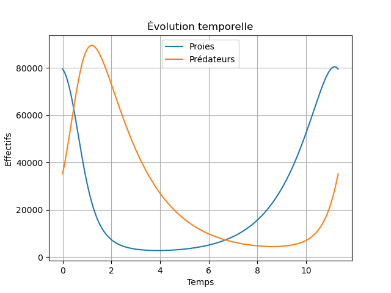](img/conditions_slides1.png)

Schéma 2 : trajectoire dans le plan de phase conditions initiales  
[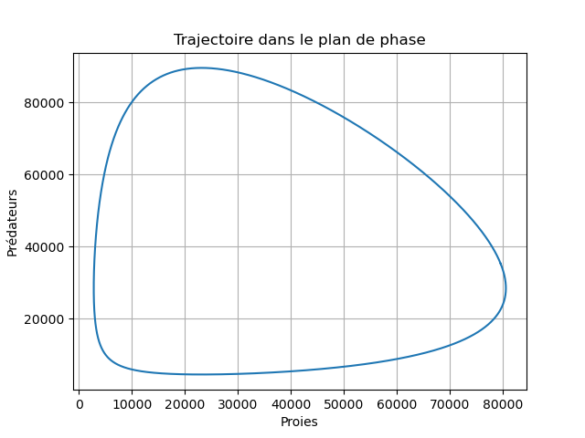](img/conditions_slides2.png)
  
> En cas de mauvais affichage, voir les fichiers [conditions_slides1.png](img/conditions_slides1.png) et [conditions_slides2.png](img/conditions_slides2.png) dans le dossier [img](img/).

#### Variation de a : 
De la même manière, mais la moyenne de population de prédateurs croît.  

Schéma 3 : trajectoire dans le plan de phase selon a 

[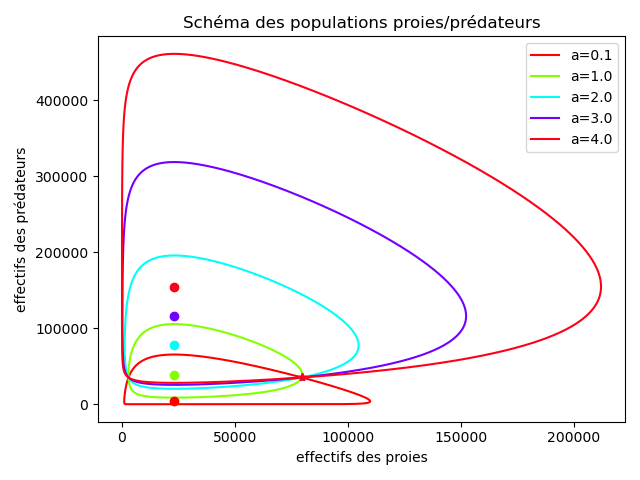](img/test_a.png)

> En cas de mauvais affichage, voir [test_a.png](img/test_a.png) dans le dossier [img](img/).

#### Variation de b et d : 

Voir schéma, pour les valeurs $b = d = [1, 1.5, 2, 2.5, 3] * 10^{-5} $ :

Schéma 4 :  trajectoire dans le plan de phase selon b = d

[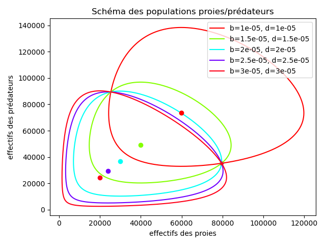](img/test_bd.png)

> En cas de mauvais affichage, voir [test_bd.png](img/test_bd.png) dans le dossier [img](img/).

#### Variation de c : 

Voir schéma, pour les valeurs $c = [1, 2, 3, 4, 5]$ :

Schéma 5 :  trajectoire dans le plan de phase selon c

[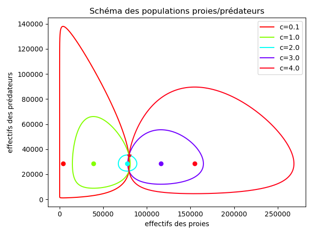](img/test_c.png)

> En cas de mauvais affichage, voir [test_c.png](img/test_c.png) dans le dossier [img](img/).

#### Variation simultanée de a et c : 

On peut également faire varier les paramètres a et c simultanément.

Schéma 6 :  trajectoire dans le plan de phase selon a et c

[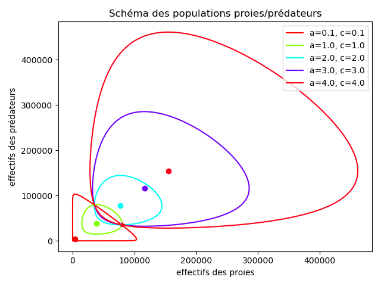](img/test_ac.png)

> En cas de mauvais affichage, voir [test_ac.png](img/test_ac.png) dans le dossier [img](img/).

#### Variation de $x_0$ et $y_0$ : 
En modifiant simultanément les valeurs iniales, on obtient un schéma de forme similaire, de même point d'équilibre (puisque $x_0$ et $y_0$ n'entrent pas en compte dans le calcul du point d'équilibre tant qu'ils sont >0) mais d'envergure différente.  
Schéma pour valeurs $x_0 = y_0 = [1, 2, 3, 4, 5]$ :

Schéma 7 :  trajectoire dans le plan de phase selon x0

[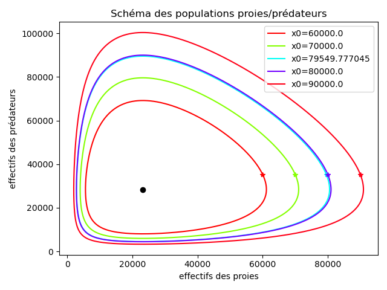](img/test_x0.png)

Schéma 8 :  trajectoire dans le plan de phase selon y0

[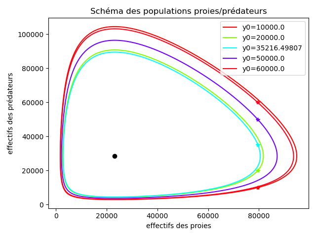](img/test_y0.png)

Schéma 9 :  trajectoire dans le plan de phase selon x0 et y0

[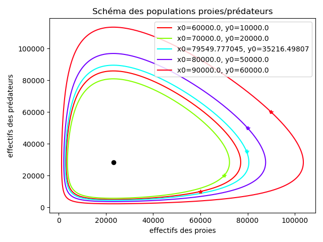](img/test_x0y0.png)

 
> En cas de mauvais affichage, voir les fichiers [test_x0.png](img/test_x0.png), [test_y0.png](img/test_y0.png), [test_x0y0.png](img/test_x0y0.png) dans le dossier [img](img/).

### Modèle "Wolf Sheep Predation"

#### Modèle sans herbe

Sans herbe, les trois cas de figure sont : 
- cas (a) : Les loups disparaissent et les moutons se multiplient jusqu'à envahir la Terre.
- cas (b) : Les loups mangent tous les moutons, puis meurent tous par manque de nourriture.
- cas (c) : Les loups mangent et se reproduisent trop lentement pour amortir la croissance de la population de moutons, qui explose exponentiellement malgré la présence de loups.

Schéma 10 : cas de figure (a)

[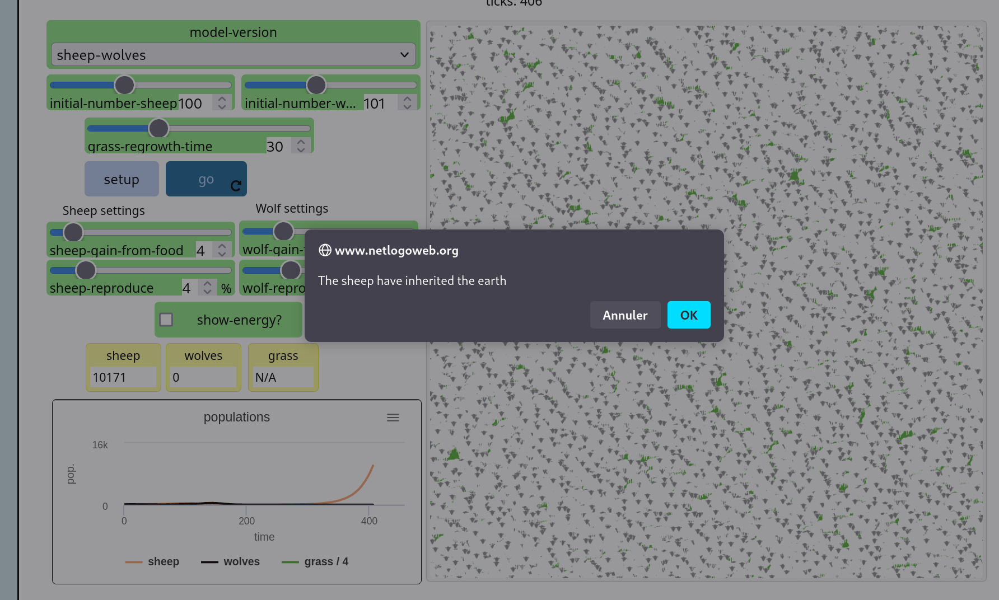](img/netlog_sheepocalypse.png)

Schéma 11 : cas de figure (b)

[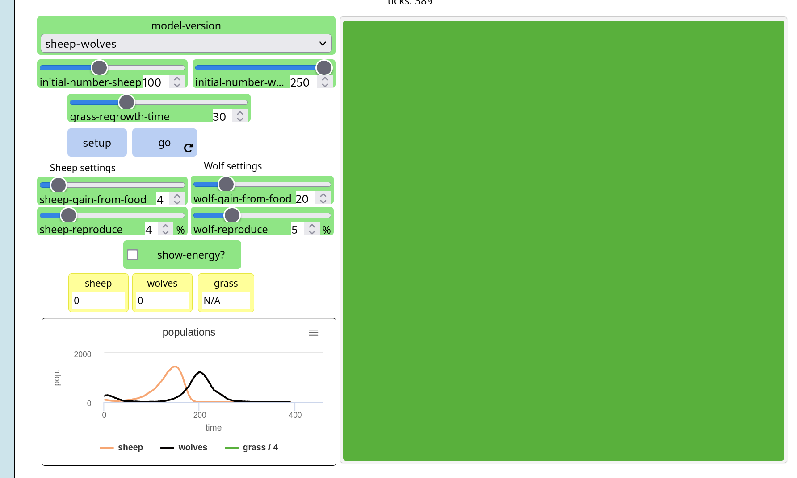](img/netlog_sheepdeath_wolfdeath.png)

En modifiant les paramètres du programme, nous avons tenté d'atteindre un cycle de prédation stable, comme celui du modèle de Lotka-Voltera, sans y parvenir. Dans le meilleur des résultats obtenus, illustrés ci-dessous deux périodes à peu près identiques se sont produites, mais lors de la troisième le nombre de moutons a beaucoup augmenté, suivi par le nombre de loups, et nous sommes retombé dans le cas de figure (b).

Schéma 12 : résultat le plus proche du modèle de Lotka-Voltera

[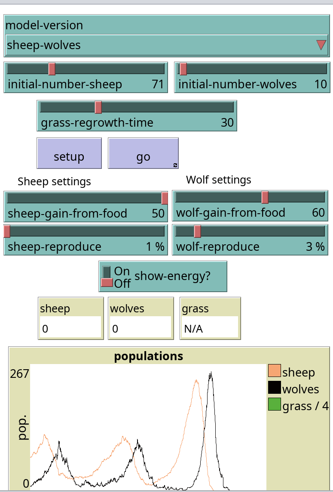](img/netlog_almost_stable.png)

> En cas de mauvais affichage, voir les fichiers [netlog_sheepocalypse.png](img/netlog_sheepocalypse.png), [netlog_sheepdeath_wolfdeath.png](img/netlog_sheepdeath_wolfdeath.png), [netlog_almost_stable.png](img/netlog_almost_stable.png) dans le dossier [img](img/).

#### Modèle avec herbe

Quand l'on rajoute une population supplémentaire, l'herbe, le modèle se stabilise.

Schéma 12 : modèle de prédation stable  

> En cas de mauvais affichage, voir le fichier [netlog_stable_with_grass.png](img/netlog_stable_with_grass.png)  dans le dossier [img](img/).

De plus, même si l'on initialise la population de loup à 0, les populations de moutons et d'herbes restent dans un état stables l'une par rapport à l'autre. Cela peut s'expliquer par le mode de reproduction différent entre les moutons et l'herbe, comme le fait que l'herbe ne peut pas disparaitre entièrement 

### Modèle "docked hybrid"

Le modèle à équation différentielle donne une évolution lisse et prévisible de la population, tandis que le modèle multi-agent montre plus de variabilité, avec des fluctuations et des décalages dus aux interactions individuelles
